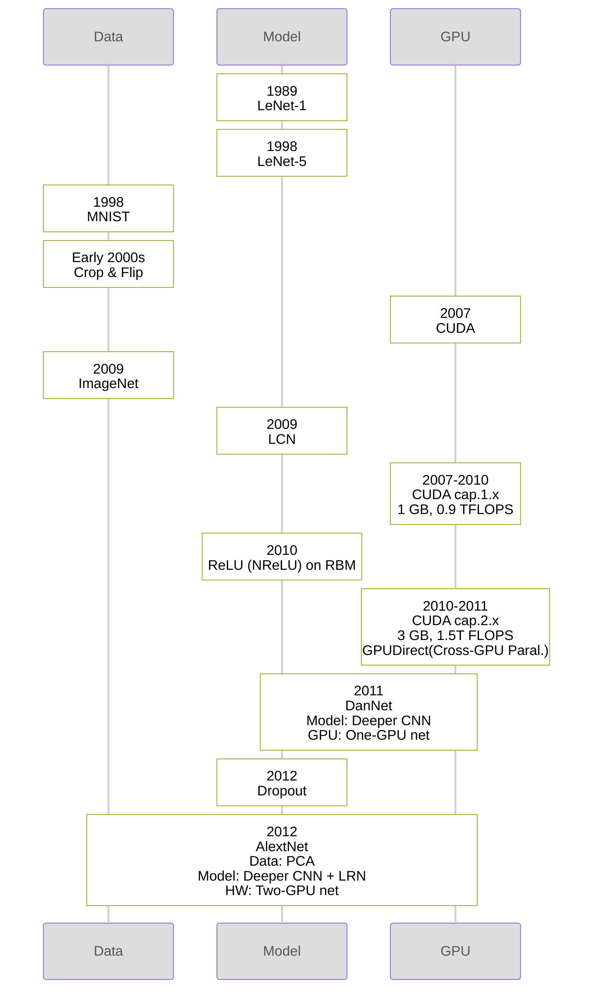

# 장동욱

# Brief History of CNN

The paper highlights Data, Model and GPU a`s key factors of model performance. Although AlexNet was a breakthrough in each factor, it would not have been possible without the predecessors of each factor.

[Timeline of CNN](%E1%84%8C%E1%85%A1%E1%86%BC%E1%84%83%E1%85%A9%E1%86%BC%E1%84%8B%E1%85%AE%E1%86%A8%20decc61dfca1e40a988111eebfb78515b/Timeline%20of%20CNN%20bad79f4243744147b9f7b97305b7023a.csv)

 and [AlexNet](https://en.wikipedia.org/wiki/AlexNet) convolution, pooling, and dense layers](%E1%84%8C%E1%85%A1%E1%86%BC%E1%84%83%E1%85%A9%E1%86%BC%E1%84%8B%E1%85%AE%E1%86%A8%20decc61dfca1e40a988111eebfb78515b/image.png)

Comparison of the [LeNet](https://en.wikipedia.org/wiki/LeNet) and [AlexNet](https://en.wikipedia.org/wiki/AlexNet) convolution, pooling, and dense layers

Winners of CV competitions

[Number of Layers in CNN](%E1%84%8C%E1%85%A1%E1%86%BC%E1%84%83%E1%85%A9%E1%86%BC%E1%84%8B%E1%85%AE%E1%86%A8%20decc61dfca1e40a988111eebfb78515b/Number%20of%20Layers%20in%20CNN%20be45fbd56c2143fda1be5f2a91200575.csv)

# AlexNet

## New in AlexNet

### **Color Jittering - `Data`**

**Principal Component Analysis (PCA)** is a statistical technique used to reduce the dimensionality of data while preserving as much of the data’s **variance** as possible. It does this by transforming the original variables into a new set of variables called **principal components**, which are uncorrelated and ordered by the amount of variance they capture from the data. Improves the model’s robustness to lighting changes and color variations.

$$
I_{xy} = \begin{bmatrix} I^R_{xy} \\ I^G_{xy} \\ I^B_{xy} \end{bmatrix} \\
I{\prime}{xy} = I{xy} + \left[ \mathbf{p_1}, \mathbf{p_2}, \mathbf{p_3} \right] \begin{bmatrix} \alpha_1 \lambda_1 \\ \alpha_2 \lambda_2 \\ \alpha_3 \lambda_3 \end{bmatrix}
$$

$$
\left[ \mathbf{p_1}, \mathbf{p_2}, \mathbf{p_3} \right] \begin{bmatrix} \alpha_1 \lambda_1, \alpha_2 \lambda_2, \alpha_3 \lambda_3 \end{bmatrix}^{\top}\\
= 
\left[ \mathbf{p_1}, \mathbf{p_2}, \mathbf{p_3} \right] \begin{bmatrix} \alpha_1 \lambda_1 \\ \alpha_2 \lambda_2 \\ \alpha_3 \lambda_3 \end{bmatrix}\\
= 
\begin{bmatrix} p^R_1 & p^R_2 & p^R_3 \\ p^G_1 & p^G_2 & p^G_3 \\ p^B_1 & p^B_2 & p^B_3 \end{bmatrix} \begin{bmatrix} \alpha_1 \lambda_1 \\ \alpha_2 \lambda_2 \\ \alpha_3 \lambda_3 \end{bmatrix}\\
= 
\begin{bmatrix} p^R_1 \cdot \alpha_1 \lambda_1 + p^R_2 \cdot \alpha_2 \lambda_2 + p^R_3 \cdot \alpha_3 \lambda_3 \\ p^G_1 \cdot \alpha_1 \lambda_1 + p^G_2 \cdot \alpha_2 \lambda_2 + p^G_3 \cdot \alpha_3 \lambda_3 \\ p^B_1 \cdot \alpha_1 \lambda_1 + p^B_2 \cdot \alpha_2 \lambda_2 + p^B_3 \cdot \alpha_3 \lambda_3 \end{bmatrix}
$$

$$
I_{xy}\\
I{\prime}_{xy}\\
\mathbf{p_1}, \mathbf{p_2}, \mathbf{p_3}\\
\alpha_1, \alpha_2, \alpha_3 \\
\lambda_1, \lambda_2, \lambda_3 \\
$$

Original RGB value at (x,y)
Jittered RGB value at (x,y) after perturbation

Eigenvectors in RGB space, represents direction of color variance across dataset
Random scalars drawn from a Gaussian distribution

Eigenvalues representing the magnitude of variance along each direction

### LRN - `Model`

**Local Response Normalization (LRN)** is a technique used in neural networks to help improve generalization and model performance by normalizing neuron responses across neighboring neurons. LRN is inspired by biological processes, specifically **lateral inhibition** in neurons, where neurons inhibit the activity of nearby neurons to promote feature competition. This is replaced by **batch normalization** for the modern architectures.

**LCN**

Spatial Neighborhood

$$

v_{ijk} = x_{ijk} - \sum_{ipq} w_{pq} \cdot x_{i, j+p, k+q}
$$

$$
y_{ijk} = \frac{v_{ijk}}{\max(c, \left( \sum_{ipq} w_{pq} \cdot v_{i, j+p, k+q}^2 \right)^{1/2})}

$$

$$
x_{ijk}\\
w_{pq}\\
v_{ijk}\\
\mu_{x,y}\\
\sigma_{x,y}\\
c
$$

Activation at spatial location (j, k) in channel  i
Gaussian weighting coefficient within spatial neighborhood (p, q).

Normalized activation at (i, j, k)

Local mean.
Local standard deviation.

Small constant to avoid division by zero.

**Batch Normalization**

👨🏻‍🏫 [Normalizing Activations in a Network](https://coursera.org/share/e5bad0cfe06e3169101555c4aacea1fb)

subtractive step (centering) & divisive step (scaling)


$$
{z}^{(i)}_{norm} = \frac{{z}^{(i)} - \mu}{\sqrt{\sigma^2 + \epsilon}}
$$


Scaling and Shifting

$$
\hat{z}^{(i)} = \gamma{z}^{(i)}_{norm} + \beta
$$

**LRN**

Channel-Based Normalization

$$
b_{x,y}^i = \frac{a_{x,y}^i}{\left( k + \alpha \sum_{j=\max(0, i - n/2)}^{\min(N-1, i + n/2)} \left( a_{x,y}^j \right)^2 \right)^{\beta}}
$$

$$
b_{x,y}^i\\
a_{x,y}^i\\
k\\
\alpha\\
\beta\\
n
$$

Normalized output at position (x, y) in feature map  i .

Original activation at (x, y) in feature map  i
Constant added for numerical stability.

Scaling parameter.
Exponent for scaling.

Number of adjacent channels to include in normalization.

### 2-GPU Net - `GPU`  / `Model`

## Popularized by AlexNet

### ReLU - `Model`

👨🏻‍🏫 [Why is Deep Learning taking off? - Switching to ReLU made gradient descent much faster](https://coursera.org/share/0a61ee951fa8f1edee71a8bdf764c145)

👨🏻‍🏫 [Vanishing/Exploding Gradients](https://www.coursera.org/videos/deep-neural-network/C9iQO)

### Dropout - `Model`

👨🏻‍🏫 [Dropout Regularization](https://coursera.org/share/b5f3fc433ea923dcbcc8e222b43b69b2)

👨🏻‍🏫 [Understanding Dropout](https://coursera.org/share/006a9830781f354728423fc6e7e10d24)

## Implementations

[https://paperswithcode.com/paper/imagenet-classification-with-deep](https://paperswithcode.com/paper/imagenet-classification-with-deep)

[Implementations of AlexNet](%E1%84%8C%E1%85%A1%E1%86%BC%E1%84%83%E1%85%A9%E1%86%BC%E1%84%8B%E1%85%AE%E1%86%A8%20decc61dfca1e40a988111eebfb78515b/Implementations%20of%20AlexNet%20e1d509c352984361b761962356a424d6.csv)

### Code Structure

- HP, data loading/augmentation, Epoch & Batch management → .py files
- Layer definitions → .cfg files
- Forward/back propagation → .cu files
- Matrix operations → .cpp file
- ~~dirty details~~
    - options (convnet.py:`get_options_parser`())
        - epoch: 50000
        - testing_freq: 50
            - sync with host, test, print test result, save checkpoint
        - batch
            - loading
                - epoch = batch_range
                - batch_range = list of `batchnum`s
                - batch_idx = index for `batch_range` and points to current batchnum
                - curr_batchnum = batch_range[batch_idx]
            - start_batch
            - get_next_batch
                - get_next_batach()
                    - return current epoch and batchnum
                    - and advance_batch()
                - advance_batch()
                    - if batch_idx overflow → advance to next epoch
            - finish_batch

> *a very efficient GPU implementation of the convolution operation*
>

### CUDA Kernels

Accelerate convolution-related operation by parallel execution on the GPU.

Can specify # of blocks and threads. → Determined implicitly in TensorFlow, Keras, PyTorch

Functions declared with `__global__` keyword.

Convolution, pooling, activation, normalization, gradient, matrix operations.

| Level | Description | Units/Size | Communication |
| --- | --- | --- | --- |
| **Grid** | Collection of blocks, providing large-scale parallelism | User-defined | Global Memory |
| **Block** | Collection of threads within a grid, can synchronize and share memory | ≤ 1024 threads | Shared Memory |
| **Warp** | Group of 32 threads within a block, executes instructions simultaneously | 32 threads | Registers, Local & Global Memory |
| **Thread** | Smallest execution unit, executes individual instructions and accesses memory | 1 | Registers, Local & Global Memory |

### Shared Memory

Reduce global memory accesses.

Variables declared with `__shared__` keyword.

Gaussian filter(or kernel), mean-centered activations(forward/back prop., norm.), image(pooling), activation(gradient, LRN)

| Memory Type | Scope | Speed | Size | Access | Typical Use Case |
| --- | --- | --- | --- | --- | --- |
| **Registers** | Private to thread | Fastest | Very small | Only by the owning thread | Frequently used thread-local variables |
| **Shared** | Within block | Fast | Limited (48KB) | Threads in the same block | Inter-thread communication in a block |
| **Global** | All blocks & host | Slow | Large (GBs) | All threads and host | Large data storage for cross-block access |

### Loop Unrolling

Minimize overhead from loop control instructions.

Enable unrolled operations to be scheduled for GPU in parallel manner.

Place `#pragma unroll` above the loop to optimize.

# CNNs after AlexNet

Legacy that AlexNet has left.

- Deep and layered Architectures
- GPU training

[Influence on Later Models](%E1%84%8C%E1%85%A1%E1%86%BC%E1%84%83%E1%85%A9%E1%86%BC%E1%84%8B%E1%85%AE%E1%86%A8%20decc61dfca1e40a988111eebfb78515b/Influence%20on%20Later%20Models%205b2ce9b5b6334bb88481424259a334ca.csv)

Breakthroughs in filters, residual connections and more data augmentation methods.